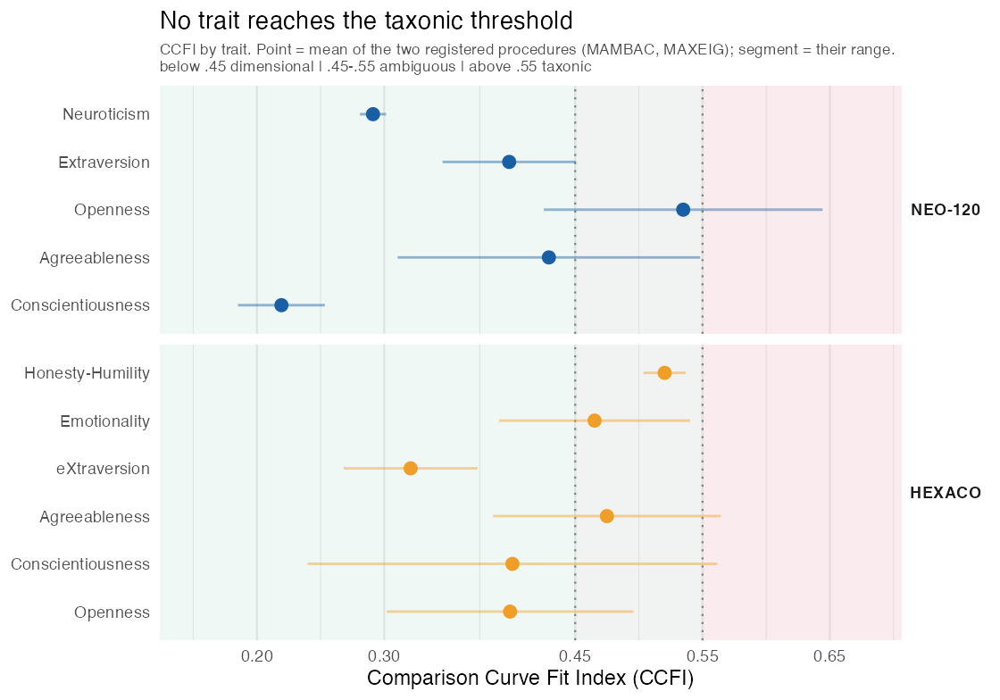

<!-- Assembled manuscript. Prose rewritten in a human voice (first person, em-dashes minimized).
     Numbers match the confirmatory analysis. CITATIONS BELOW ARE FILLED FROM MEMORY AND MUST BE
     VERIFIED against the originals (years, pages, the Katahira commentary title) before submission. -->

```{=latex}
\newpage
```

# Introduction

Few ideas about personality are as easy to like as the idea that people come in kinds. We call each
other introverts and extraverts as though naming two species; we sort ourselves into four-letter
codes; and every few years a study announces that the data, left to themselves, fall into a handful of
personality types. One widely cited paper found four [@gerlach2018]. The appeal is no mystery. A type
is something you can hold in your head; a position in a five- or six-dimensional space is not.

But a clustering method will find types whether or not any are there. Give a mixture model a single
smooth cloud of data and it still reports two or three or ten groups, because each added group trims
the fit a little and the selection rule takes the trade. A clean partition is not much of a finding by
itself. The question worth asking is not how many types a method returned, but whether they do anything
more than trace the shape the data already had.

On personality itself, the argument is largely over. Taxometric and structural studies have looked for
categories in trait data for years and kept finding gradients instead [@haslam2012; @haslam2020]. I am
not trying to reopen that. What the settled view still lacks is a way to check a specific claim, this
dataset and these respondents and this many types, against a null that means something, and a sense of
how much the claim depends on choices made before any result is in view.

Past attempts to impose that discipline fall short in ways worth naming. The best-known typology study
tested its clusters against data with all the associations shuffled out [@gerlach2018], but data with
no correlations is a low bar, and almost anything real clears it. A later comment said as much, without
building the alternative it asked for [@katahira2020]. Taxometrics asks the categorical-versus-continuous
question head-on [@meehl1995; @ruscio2006], but it works from a fixed set of indicators and has nothing
to say about how many clusters there are, or how that number moves when the model changes.

My approach has three parts, and none is new on its own. The null is a Gaussian copula. It keeps every
trait's distribution and the whole covariance matrix and scrambles only what is left, the higher-order
dependence, so a cluster counts as real only if it survives a world that already shares the data's
margins and correlations. This is the constructed null the earlier comment called for. I then refuse to
report a single number; the same test runs across all fourteen covariance parameterizations of the
mixture model, and I show the whole spread of answers rather than the one I happen to prefer. And I
bring in taxometrics as an outside witness, so the verdict does not rest on one method's assumptions.
All of it is aimed at the personality-types question, across three datasets.

The picture that comes back is consistent. Change the covariance assumption and the number of types
walks from one to ten. Hold the rest fixed and, by the measure I committed to in advance, that number
is no different from what the typeless null gives. No trait crosses the taxometric line. I do not read
this as news about personality. I read it as a demonstration of a test, and as a standard the next
typology can be measured against.

# Background

## A cluster solution settles nothing on its own
The wish to sort people into kinds is old, and it keeps coming back in quantitative dress: clinical
subtypes, learner profiles, data-driven personality types. The trouble is always the same. Clustering
and mixture methods exist to partition; give them continuous data and they partition it, and a
selection criterion will almost always prefer more than one piece. So "the data support k clusters"
quietly mixes a fact about people with a fact about the procedure, and the procedure rarely has to
answer for itself, to say what a world with no types would have produced under the same treatment.

## What is already settled
Whether traits come in classes or in degrees has been asked many times and answered the same way, in
degrees [@haslam2012; @haslam2020]. Because that much is settled, the thing worth adding is not the
conclusion but a tool: something that turns a particular cluster-count claim into a claim that can fail,
and shows how much it leans on choices no one inspects.

## The null is where the argument lives
An apparent grouping is "real" only against a null that says what real means here. Shuffle every
association out of the data [@gerlach2018] and you have set the bar on the floor; the correlations alone
will clear it. @katahira2020 saw this but stopped at the diagnosis. The cure is borrowed from elsewhere,
from the surrogate-data and matched-null traditions of nonlinear time series, network neuroscience, and
ecology, where you fix everything innocent about a dataset and randomize only the thing in question. For
a claim about clusters the copula null is the natural choice: keep the margins, keep the covariance, and
let only higher-order dependence vary, so any extra clustering has to come from structure the null
cannot hold.

## A second opinion
Taxometrics reaches the same question by a different road, asking whether the covariation among a
construct's indicators looks more like one dimension or two latent groups [@meehl1995; @ruscio2006]. The
Comparison Curve Fit Index scores the observed curves against curves simulated from frankly dimensional
and frankly categorical data. Because its assumptions are not a mixture model's, it makes a useful
outside check, though it works on a fixed indicator set and says nothing about how many clusters there
are.

## Reporting the spread, not a point
That a result can hang on a defensible choice is the premise of multiverse and specification-curve
analysis [@steegen2016; @simonsohn2020], with a longer root in the sensitivity arguments of econometrics
[@leamer1983]. The honest move is to run the reasonable specifications and show the distribution instead
of defending one. For the number of types, the choice that matters is the mixture model's covariance
assumption, which I vary in full; the matched null then says where, on that spread, a typeless world
would have landed.

# Method

## Transparency
Everything below was fixed in advance. Before I opened the held-out data I registered the decision rule
and the specification grid (OSF, seed 20260620), and what follows reports every dataset, every
covariance model, and the whole rule, with nothing added or dropped once the hold-out was in view.

## Data
I reanalyze three large public datasets, each already scored to traits and, where the instrument allows,
facets: the IPIP-NEO-120 [@johnson2014; 410,376 respondents; five domains, thirty facets]; an IPIP
fifty-item Big-Five set [@goldberg1999; 603,322; five domains, no facets defined]; and the IPIP-HEXACO
(22,734; six domains, twenty-four facets). Three instruments rather than one, so that a verdict has to
repeat across measurement systems instead of surviving in a single one.

I split each dataset in half (seed 20260620) into an exploratory and a confirmatory part, and sealed the
confirmatory part before fitting anything reported here. For the NEO-120 and the fifty-item set the
held-out respondents are almost all unseen, about 95 to 97 percent; HEXACO is small enough that the
halves overlap, with about 88 percent of its hold-out also in the exploratory split, so I treat it as a
robustness check rather than a clean confirmation. Every model was fit to a random subsample of the
held-out part, 8,000 cases at the domain level and 5,000 at the facet level. One housekeeping point
matters later: mixtures tend to select more components as the sample grows, so I always compare the real
data and its null at the same sample size.

## The covariance multiverse
I model each dataset as a Gaussian mixture and let "types" mean the components a BIC selection keeps.
mclust [@scrucca2016] offers fourteen ways to constrain a component's covariance, in volume, shape, and
orientation, running from the spherical (EII, VII) through the diagonal (EEI, VEI, EVI, VVI) to the
fully ellipsoidal (EEE through VVV). For each, I fit one to ten components and record the number BIC
prefers. The fourteen answers, taken together, are the specification curve: how many types you find as a
function of an assumption that carries no meaning about people.

## The Gaussian-copula matched null
To ask whether a clustering is more than the data's own margins and covariance, I compare it to a null
that holds both fixed and frees only the rest. From a real $n \times p$ subsample I take the correlation
matrix and its Cholesky factor, draw a matrix of independent standard-normal numbers, correlate them
through that factor, and then, column by column, replace each correlated normal variable with the sorted
real values of that variable laid down in the same rank order. What comes out has every marginal
exactly, the full covariance to within sampling error (the largest correlation it misses is about
0.009), Gaussian dependence, and no clustering built in. That is the right null for the question. It
fixes everything a single-cloud description already carries, so any excess clustering in the real data is
structure the null could not have. I drew eighty such nulls for each domain dataset and fifty for each
facet dataset.

## Taxometric analysis
For the categorical-versus-continuous question head-on, I hand each trait's facets (six per NEO-120
trait, four per HEXACO trait) to three taxometric procedures, MAMBAC, MAXEIG, and L-Mode, through
RTaxometrics [@ruscio_rtax]. The CCFI scores the observed curves against curves simulated from
explicitly dimensional and explicitly categorical comparison data, returning a number between zero and
one: below .45 reads dimensional, above .55 categorical, with an ambiguous band between [@ruscio2006]. I
report each trait's CCFI as the average of the three procedures and keep the spread among them in view.
The fifty-item set has no facets, so this part covers only the NEO-120 and HEXACO.

## The pre-registered decision rule
The rule was set before the hold-out opened; the full text is in the registration. In short: I credit an
instrument with real structure only if its clustering gain, the BIC improvement of the best mixture over
a single component, beats the 95th percentile of the matched null's. I call the structure continuous only
if four things hold together: mean within-trait CCFI under .45 with no trait at .55 or above, in both
instrument families; fewer than half of respondents confidently placed in any one component, at a
posterior above .8; the first split, from one component to two, carrying more than three-quarters of the
total BIC gain; and the spread of selected counts across the fourteen models indistinguishable from the
null's, with the real median inside the null's 95 percent interval. The opposite verdict, real types,
needs the opposite signs: a CCFI at .55 or above that repeats across instruments, a clear BIC minimum
with gaps between component centers, most respondents confidently placed, and a count that holds steady
across datasets. The NEO-120 and the fifty-item set are the confirmatory pair and have to agree; HEXACO
is robustness only.

For the record, the statistics are these. $\Delta$BIC is the best-of-fourteen BIC minus the
one-component BIC; the count summarized across models is the median of the fourteen; the first-split
share is the two-component gain over the total gain, both measured on the best-of-fourteen envelope; and
the confident-assignment share is the fraction of respondents whose top posterior exceeds .8 under the
selected solution.

## Software
R [@rcoreteam], with mclust for the mixtures and RTaxometrics for the CCFI; seed 20260620 throughout.
Data, code, and the registration are public.

# Results

## The covariance assumption sets the count
Start with the count itself, and it refuses to settle. Across the fourteen covariance models the number
of components BIC keeps runs from one to ten (Figure 1). At the facet level it spans the whole grid in
both the NEO-120 and HEXACO; even at the domain level it runs from three to ten in HEXACO and five to
ten in the NEO-120. The parameterization means nothing about people, it is a convenience, yet it moves
the apparent number of types across almost the entire range anyone might report. The drift has a
direction. The richer ellipsoidal models keep fewer components than the plain spherical and diagonal
ones, because a flexible covariance can absorb the continuous shape that a rigid one can only chase by
adding pieces. The count is not a property of the respondents. It is settled before the data are seen,
by a choice in the model.

{width=95%}

## There is real structure, but weak against the data's own shape
A wandering count does not by itself prove the structure is empty, so I compared each dataset to the
matched null. In all five slices the real clustering gain beat the null's 95th percentile: 717 against
485 for the NEO-120 domains, 1,369 against 913 for the fifty-item domains, 816 against 213 for the HEXACO
domains, and 4,013 against 1,073 and 2,701 against 337 for the two facet sets. Real personality data,
then, is not just its margins and covariance dressed up; some genuine higher-order structure is there in
every case. That is a statement about leaving a Gaussian-dependence world behind. It is not yet a
statement about categories.

## The count is no larger than a typeless world's
The next question is whether that real structure shows up as more types. The null has no types by
construction, but it still produces multi-component solutions of its own, so the test is whether the real
count runs higher. By the measure I registered, the median count across the fourteen models, it does not.
The real median sits inside the null's 95 percent interval in every slice: 5 in [4.0, 7.0] for the
NEO-120 domains, 4 in [3.0, 6.4] for its facets, 8 in [6.0, 8.8] for the fifty-item domains, 7 in [3.5,
7.5] for the HEXACO domains, and 4 in [1.0, 4.9] for its facets. The grey band in Figure 1 marks the
null's interval; wherever the dashed real median falls inside it, the typical number of types is one the
typeless world could have produced.

The mean tells a slightly different story, and the difference is worth keeping. Averaged rather than taken
at the median, the count does exceed the null in the fifty-item and HEXACO sets. The two part ways because
the per-model counts are skewed: a few covariance models run all the way to the ten-component ceiling, and
that tail pulls the mean up while leaving the median where it is. I registered the median, and I report
the mean too. That a verdict can hinge on which summary of the same fourteen numbers you take is, if
anything, this paper's own argument turned on itself, and a reason to fix the statistic before looking.

## No trait looks like a category
The taxometric test points the same way. No trait reached the categorical threshold in either instrument
(Figure 2): across eleven traits the highest CCFI was HEXACO's Honesty-Humility, at .530. The NEO-120
facets averaged .377, the HEXACO facets .453. Several traits sat in the ambiguous band, more of them in
HEXACO, but none crossed into categorical territory. The individual procedures occasionally reached
higher, which Figure 2 shows rather than hides; the registered figure, the average of the three, did not.

{width=85%}

## People do not sort cleanly, and one cut does most of the work
Two more checks, both registered, lean the same way. Under the selected solution, fewer than half of
respondents could be placed in any single component with much confidence, at a posterior above .8: 14.6
and 48.0 percent for the NEO-120 domains and facets, 25.1 percent for the fifty-item set, 30.0 and 46.0
percent for HEXACO. And the first cut, from one component to two, carried more than three-quarters of the
total BIC gain in four of the five slices, 88.7 and 89.6 percent for the NEO-120 and 82.8 and 98.9
percent for HEXACO, the lone exception being the fifty-item domains at 61.8 percent. Where the model did
split people, it found them spread along the splits, not gathered on one side.

## The verdict
Held against the rule I set in advance, the categorical signs are missing everywhere: no CCFI at .55 that
repeats, no clear BIC minimum, no count that holds still. The NEO-120, the dataset with a clean hold-out,
meets all four continuity conditions. The fifty-item set and HEXACO meet them too, with small and
non-categorical shortfalls, the fifty-item set's first split a little less dominant and HEXACO's average
CCFI in the ambiguous band. So I find no evidence for separated types in any of the three. The clusters
they yield are ones the matched null reproduces, and the mild real structure that remains never turns
into extra types or into categories. HEXACO I keep as a robustness check, since its hold-out is not
clean.

# Discussion

I set out to ask whether the types a mixture model reports in personality data are categories of people
or just the data's continuous shape, and I tried to settle it with a test rather than one more
clustering. Each dataset met a copula matched null that keeps its margins and covariance; the test ran
across all fourteen covariance models; and a taxometric index gave a second reading. Across three large
datasets the count ran from one to ten on the covariance assumption alone, sat inside the typeless null
by the registered measure in every case, and never reached the taxometric line for a category.

I take this as a result about method, not about people. That traits are continuous is old news
[@haslam2012; @haslam2020]; I am not adding to that case so much as handing it an instrument, one that
makes the standing claim "this dataset has N types" something that can be checked, and shows the number
at its heart to be set by a choice that means nothing.

The claim is meant to be narrow. The null tests one thing, whether the clustering beats the linear
dependence already in the data, and on that test the real data does carry structure the null cannot
make; every dataset cleared the bar. But that leftover structure does not become more types, and it does
not become taxonic curves. So the honest line is "no evidence for separated types," not "perfectly
continuous." Something real is there, in every dataset, below the level of a category, and I do not try
to name it here. Skew, a little nonlinearity, some unevenness in density: any of these would do, and none
is a kind of person.

One thing in my own analysis makes the point better than I could. Whether the count beats the null
depends on whether you read it at the mean or the median, because a few models run to the ceiling and
skew the average. I registered the median; the mean says otherwise; I report both. A verdict that turns
on which summary you pick is exactly the trouble this paper is about, and a reason to name the statistic
before the data are in front of you.

The test is not about personality in particular. Any claim that continuous measurements fall into so
many groups can be put to a matched null, and the habit of reporting a spread of answers instead of a
favorite one travels anywhere a modeling choice is beside the point. It sits alongside taxometrics, which
asks the same question from other assumptions, and it builds the constructed null that earlier critics of
typology work asked for and did not supply [@katahira2020]; an independence null, again, asks too little.

There are limits. A multiverse is only as honest as the choices it spans, and I varied the covariance
assumption fully while holding the mixture family, the selection criterion, and the resolution fixed; a
wider one could be drawn. The null tests linear dependence, so a clustering driven by something genuinely
curved but still continuous would read as real without being a category, which is close to what I see,
and which the null is right not to call a type. The datasets are large but self-selected, three of a
kind, all from the IPIP pool, and subsampled to keep the computation in hand; HEXACO's hold-out is not
clean. And I test for separated categories and their number, not for whether a rough typology is ever a
useful way to talk; finding no taxa does not mean a typology can never be a convenient shorthand, only
that it is not a discovery of kinds.

The use of all this is small and practical. A number of clusters is not yet a finding. It becomes one
only when it beats what the data's own margins and covariance produce, and survives the choices, here the
covariance assumption, that should have made no difference. I have left the test where others can pick it
up, so that the next claim of N types can be asked, first of all, whether N belongs to people or to the
procedure.

# Conclusion

The number of types a method reports is not, by itself, a fact about people. For personality, a case
studied to the point of consensus, I have shown the count drifting across the whole range as one
inconsequential assumption is changed, staying inside what a typeless null produces, and never showing a
categorical signature in any trait. None of that is news about personality. The test is the point. It
makes a given claim of N types fail or survive against a null that means something, and lays bare how much
the claim depended on choices no one was watching. The materials are public, so the next claim can face
the same check. Whether a structure is real and whether it is a set of kinds are two questions, and a
count of clusters answers neither until it is asked against the right null.

# References {.unnumbered}

::: {#refs}
:::
